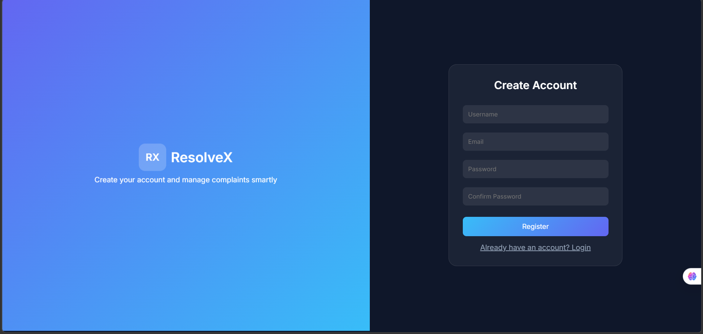
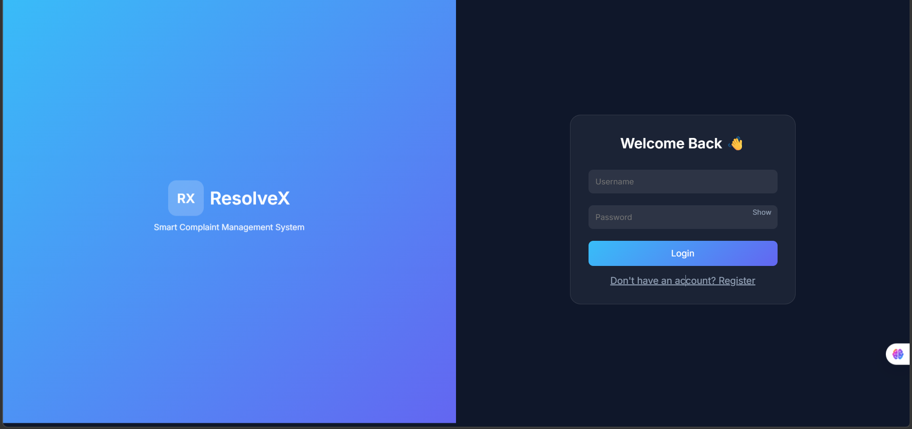
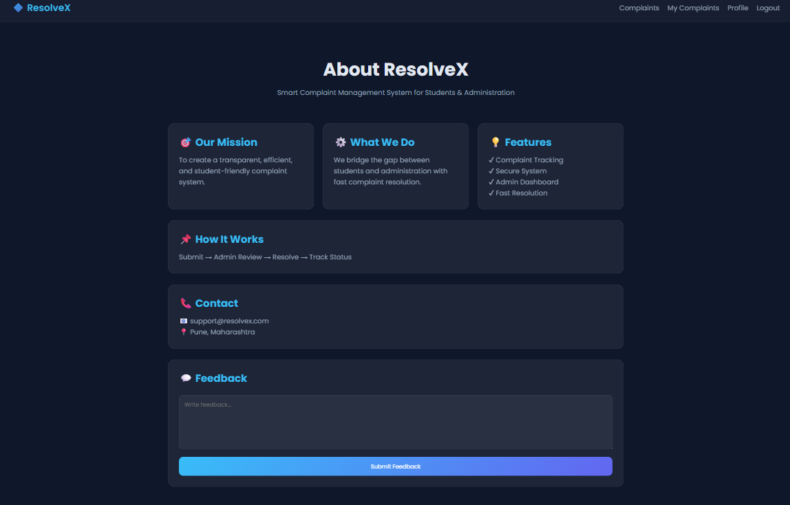
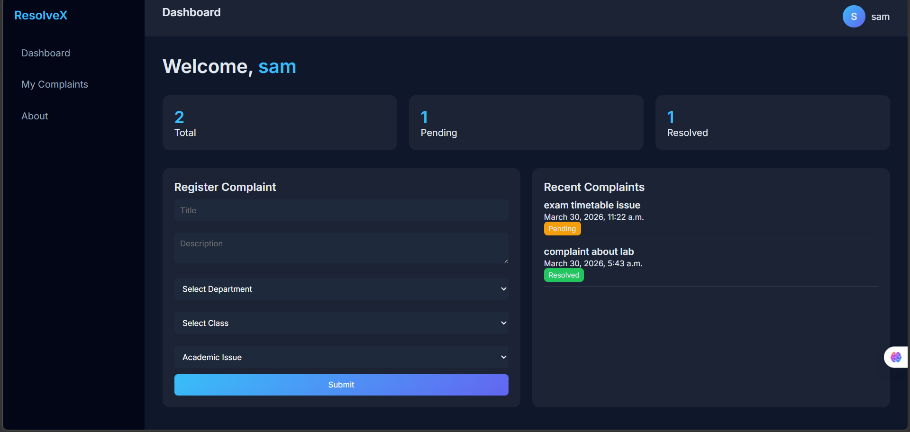

# 📝 Complaint Management System

A web-based **Complaint Management System** developed using **Django** and **MySQL** that helps users submit, manage, and track complaints efficiently through a secure and user-friendly platform.

The system provides role-based access for users and administrators, enabling smooth complaint handling and status monitoring.

---

# 🚀 Features

## 🔐 User Authentication
- User Registration
- User Login & Logout
- Secure Authentication System
- Profile Management

## 📝 Complaint Management
- Submit Complaints
- View Complaint Details
- Update Complaint Information
- Delete Complaints

## 🔄 Complaint Status Tracking
- Pending Status
- In Progress Status
- Resolved Status

## 🧑‍💼 Admin Dashboard
- Manage User Complaints
- Update Complaint Status
- Monitor Complaint Activities
- Complaint Overview Dashboard

## 🔍 Search & Filter
- Search Complaints
- Filter by Status
- Quick Complaint Access

## 🎨 Responsive User Interface
- Clean User Interface
- Mobile Friendly Design
- Responsive Layout

---

# 🛠️ Technology Stack

| Technology | Purpose |
|------------|----------|
| Python | Backend Programming |
| Django | Web Framework |
| MySQL | Database Management |
| HTML5 | Frontend Structure |
| CSS3 | Styling |
| JavaScript | Client-side Functionality |
| Bootstrap | Responsive UI |

---

# 📂 Project Structure

```bash
Complaint-Management-System/
│
├── complaint_system/
│   ├── settings.py
│   ├── urls.py
│   ├── asgi.py
│   └── wsgi.py
│
├── complaints/
│   ├── migrations/
│   ├── templates/
│   ├── static/
│   ├── models.py
│   ├── views.py
│   ├── forms.py
│   ├── urls.py
│   └── admin.py
│
├── Screenshots/
├── manage.py
├── requirements.txt
├── .gitignore
└── README.md
```

---

# ⚙️ Installation Guide

## 1️⃣ Clone Repository

```bash
git clone https://github.com/your-username/Complaint-Management-System.git
```

```bash
cd complaintsystem
```

---

## 2️⃣ Create Virtual Environment

```bash
python -m venv venv
```

### Activate Virtual Environment

### Windows

```bash
venv\Scripts\activate
```

### Linux / Mac

```bash
source venv/bin/activate
```

---

## 3️⃣ Install Dependencies

```bash
pip install -r requirements.txt
```

---

# 🔐 Configure Database

Update your `settings.py` file:

```python
DATABASES = {
    'default': {
        'ENGINE': 'django.db.backends.mysql',
        'NAME': 'complaint_db',
        'USER': 'root',
        'PASSWORD': 'your_password',
        'HOST': 'localhost',
        'PORT': '3306',
    }
}
```

---

# 🗃️ Apply Database Migrations

```bash
python manage.py makemigrations
```

```bash
python manage.py migrate
```

---

# 👤 Create Superuser

```bash
python manage.py createsuperuser
```

---

# ▶️ Run Development Server

```bash
python manage.py runserver
```

Open browser:

```bash
http://127.0.0.1:8000/
```

---

# 📸 Screenshots

## 📝 Register Page


## 🔐 Login Page


## ℹ️ About Page


## 👤 User Profile


## 📋 View Complaints


## 📊 Complaint Dashboard


## ✏️ Update Complaint Page


---

# 🔒 Security Features

- Password Hashing
- CSRF Protection
- Secure Authentication
- Django Built-in Security Features

---

# 📊 Key Highlights

- Role-Based Access Control
- Complaint Status Workflow
- Responsive User Interface
- Efficient Complaint Handling System

---

# 🌟 Future Enhancements

- Email Notifications
- Analytics Dashboard
- AI-based Complaint Classification
- Complaint Priority System
- SMS Notifications

---

# Virtual Environment
venv/
env/

# Environment Variables
.env

# Static & Media
media/
staticfiles/

# VS Code
.vscode/

# Logs
*.log
```

---

# 👩‍💻 Author

## Harshali Kulkarni  
MCA Student  
Python & Django Developer

---

# 📜 License

This project is developed for educational and learning purposes.
